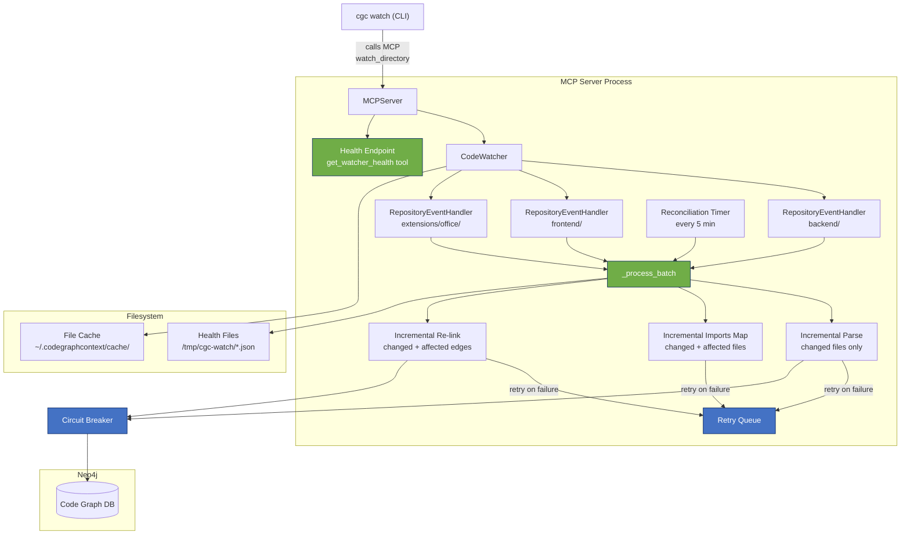

# CGC Watcher Overhaul — Implementation Specification

**Version:** 1.0  
**Date:** 2026-03-28  
**Status:** Proposed  
**Repo:** `/Users/felixcardix/dev-workspaces/cgc-fix/` (fork of CodeGraphContext)  
**Verified against:** Live codebase + running processes on Felix's Mac

---

## 1. Current State (Verified via MCP + Desktop Commander)

### 1.1 Process Landscape (Live at Time of Review)

| PID | Command | CPU | RSS | Uptime | Notes |
|-----|---------|-----|-----|--------|-------|
| 15051 | `cgc watch .../extensions/office/` | **68%** | **3.5 GB** | 3h+ | Runaway — permanent re-link loop |
| 28480 | `cgc watch .../frontend/` | 0% | 11 MB | Since Tue | Healthy but idle |
| 23380 | `cgc index --force .../backend/` | 1.6% | 225 MB | 30 min | Concurrent re-index |
| 24766 | `cgc mcp start` | 0% | 122 MB | MCP server | **Has zero watcher state** |
| 25402 | `cgc mcp start` | 0% | 122 MB | 2nd MCP instance | Via supergateway |

**Critical finding:** `list_watched_paths` via MCP returns `[]` despite two active CLI watchers. The MCP server and CLI watchers are separate processes with no shared state. This means every AI agent session starts blind — it cannot know whether the graph is stale.

### 1.2 Codebase Metrics

| File | Lines | Role |
|------|-------|------|
| `core/watcher.py` | 237 | Event handler + batch processor + CodeWatcher manager |
| `core/database.py` | 273 | Neo4j singleton driver manager |
| `tools/graph_builder.py` | 1,320 | All graph operations (parse, add, delete, re-link) |
| `tools/handlers/watcher_handlers.py` | 84 | MCP tool handlers for watch/unwatch |
| `server.py` | 299 | MCP server, tool routing, lifecycle |
| `core/jobs.py` | 132 | Background job tracking |

### 1.3 Graph Size

| Metric | Count |
|--------|-------|
| Repositories | 22 (many are single-file fragments — see Section 5.5) |
| Files | 2,227 |
| Functions | 27,210 |
| Classes | 3,175 |
| Modules | 2,517 |

---

## 2. Problem Analysis

### P0: MCP/CLI Process Split (Not in Original Spec — Critical Gap)

The MCP server creates its own `CodeWatcher` instance (`server.py:82`), but CLI `cgc watch` commands create separate OS processes with their own `CodeWatcher` instances. These share a Neo4j database but have no awareness of each other.

**Impact:** AI agents using the MCP tools cannot determine graph freshness, cannot start/stop watchers, and cannot troubleshoot stale graph issues. The `list_watched_paths` tool is effectively broken.

### P1: O(N) Re-linking on Every Change (Performance — Active Emergency)

Every batch triggers three O(N) operations on the **entire** cached file set:

1. **`_pre_scan_for_imports(known_files)`** — Opens and tree-sitter-parses EVERY cached file from disk. For 960 Python files, this is 960 file reads + 960 AST parses.

2. **`_create_all_function_calls(all_data)`** — Iterates every function call in every file. Each call attempt runs up to **5 cascading `session.run()` queries** (Function→Function, Function→Class, Class→Function, Class→Class, global fallback via `_safe_run_create`). For a codebase with ~27k functions, this is potentially **100k+ individual Neo4j round-trips per batch**.

3. **`_create_all_inheritance_links(all_data)`** — Similar pattern, fewer nodes.

With a 2s debounce and 4 concurrent Claude Code agents, the re-link never finishes before the next batch fires. This is why PID 15051 is at 68% CPU / 3.5 GB RAM.

### P2: Silent Failures (Reliability)

`_process_batch()` has zero error handling. A single Neo4j timeout, parse error, or connection drop kills the batch. The watcher process stays alive (PID exists) but is effectively dead.

### P3: No Observability

No health files, no metrics, no "last successful batch" timestamp. The existing keepalive check only verifies PID existence.

### P4: No Cache Persistence

`all_file_data` is an in-memory dict. Process death or restart requires full re-scan (minutes for 960 files).

### P5: No Neo4j Resilience

`database.py` has `is_connected()` but the watcher never calls it. No retry, no backoff, no circuit breaker.

### P6: Bug in `watcher_handlers.py`

Line 66 references `add_code_to_graph_tool` which is never imported or defined — `NameError` crash for any `watch_directory` call on a non-indexed path.

Line 77: `perform_initial_scan=True` after `add_code_func()` already indexed = double initial scan.

### P7: Duplicate Graph Entries Under Concurrency

`update_file_in_graph()` does `delete_file_from_graph()` then `add_file_to_graph()`. Two concurrent batches can race on the same file, producing duplicates.

### P8: Fragmented Repository Index

22 indexed repositories include single-file entries (`EmailPanel.tsx`, `retrieval_service.py`, `entity_summary_service.py`). These are likely from ad-hoc `add_code_to_graph` calls on individual files. They pollute `list_indexed_repositories` and create overlapping graph nodes.

---

## 3. Architecture — Target State

The following diagram shows the target architecture after the overhaul. The key change is that watchers are managed by the MCP server, not by separate CLI processes.



The key architectural decisions:

1. **CLI `cgc watch` becomes a thin client** that calls the MCP server's `watch_directory` tool, not a standalone process. This eliminates the dual-process shared-state problem.

2. **Incremental processing replaces full rebuilds** — only changed files are parsed, only affected imports are rescanned, only affected edges are re-linked.

3. **Circuit breaker + retry queue** prevent Neo4j issues from killing the watcher.

4. **Health is observable via MCP** — a `get_watcher_health` tool exposes per-repo watcher state to AI agents.

---

## 4. Implementation Phases

### Phase 0: Hotfix (Do Immediately — 30 min)

These are zero-risk changes that immediately reduce the 3.5 GB / 68% CPU problem.

#### 0.1 Configurable Debounce Window

**File:** `core/watcher.py`  
**Change:** Read debounce from environment variable.

```python
# In RepositoryEventHandler.__init__():
import os
default_debounce = float(os.getenv('CGC_DEBOUNCE_SECONDS', '2'))
self.debounce_interval = debounce_interval or default_debounce
```

**Immediate action:** Set `CGC_DEBOUNCE_SECONDS=10` in the watcher environment. This alone will dramatically reduce batch frequency.

#### 0.2 Fix `watcher_handlers.py` Bugs

**File:** `tools/handlers/watcher_handlers.py`

Change 1 — Delete line 66 (the `add_code_to_graph_tool` NameError):
```python
# DELETE THIS LINE:
# scan_job_result = add_code_to_graph_tool(path=path_str, is_dependency=False)
```

Change 2 — Line 77, change `perform_initial_scan=True` to `False`:
```python
# The add_code_func already indexed the files. Don't scan again.
code_watcher.watch_directory(path_str, perform_initial_scan=False)
```

#### 0.3 Kill the Runaway Watcher

After applying 0.1 and 0.2:
```bash
kill 15051  # the 3.5 GB office watcher
# Restart with higher debounce:
CGC_DEBOUNCE_SECONDS=10 cgc watch /Users/felixcardix/dev-workspaces/di-copilot/extensions/office/
```

---

### Phase 1: Error Isolation + Retry (1.5 hr)

#### 1.1 Error-Isolated Batch Processing

**File:** `core/watcher.py` — replace `_process_batch()`

The new version wraps each file and the re-link step in separate try/except blocks. Failed files go into a retry queue.

```python
def _process_batch(self):
    """Process all files that changed during the debounce window, with error isolation."""
    with self._lock:
        paths = self._pending_paths.copy()
        self._pending_paths.clear()
        self._timer = None

    if not paths:
        return

    # Prepend any previously failed paths (with retry limit)
    retry_paths = set()
    for p in list(self._failed_paths):
        count = self._failure_counts.get(p, 0)
        if count < self._max_retries:
            retry_paths.add(p)
        else:
            error_logger(f"Dropping {p} after {self._max_retries} consecutive failures")
            self._failed_paths.discard(p)
            self._failure_counts.pop(p, None)

    all_paths = paths | retry_paths
    info_logger(f"Processing batch of {len(all_paths)} file(s) ({len(retry_paths)} retries)")
    
    supported_extensions = self.graph_builder.parsers.keys()
    batch_errors = 0
    successfully_processed = set()

    # 1. Per-file parse + cache update — each file isolated
    for path_str in all_paths:
        try:
            modified_path = Path(path_str)
            if (modified_path.exists() and modified_path.is_file()
                    and modified_path.suffix in supported_extensions):
                parsed_data = self.graph_builder.parse_file(self.repo_path, modified_path)
                if "error" not in parsed_data:
                    self.all_file_data[str(modified_path)] = parsed_data
                else:
                    self.all_file_data.pop(str(modified_path), None)
            else:
                self.all_file_data.pop(path_str, None)
            successfully_processed.add(path_str)
        except Exception as e:
            error_logger(f"Failed to process {path_str}: {e}")
            self._failed_paths.add(path_str)
            self._failure_counts[path_str] = self._failure_counts.get(path_str, 0) + 1
            batch_errors += 1
            continue

    # Clear failure state for successfully processed paths
    for p in successfully_processed:
        self._failed_paths.discard(p)
        self._failure_counts.pop(p, None)

    # 2. Incremental imports map update (Phase 2.1 — see below)
    # 3. Update changed files in graph
    # 4. Incremental re-link (Phase 2.1 — see below)
    # (Steps 2-4 are wrapped in try/except — see Phase 2 for the incremental versions)
    
    try:
        # Fallback: full rebuild until Phase 2 is implemented
        known_files = [Path(p) for p in self.all_file_data]
        self.imports_map = self.graph_builder._pre_scan_for_imports(known_files)
        
        for path_str in successfully_processed:
            self.graph_builder.update_file_in_graph(
                Path(path_str), self.repo_path, self.imports_map
            )
        
        all_data = list(self.all_file_data.values())
        self.graph_builder._create_all_function_calls(all_data, self.imports_map)
        self.graph_builder._create_all_inheritance_links(all_data, self.imports_map)
    except Exception as e:
        error_logger(f"Graph re-linking failed: {e}")
        self._needs_full_relink = True

    # 5. Update health + metrics
    self._last_batch_time = datetime.utcnow().isoformat() + "Z"
    self._last_batch_count = len(successfully_processed)
    self._batch_count += 1
    self._error_count += batch_errors
    self._write_health()

    info_logger(f"Batch complete: {len(successfully_processed)} OK, {batch_errors} errors")
```

#### 1.2 New Instance Variables

Add to `RepositoryEventHandler.__init__()`:

```python
# Retry queue
self._failed_paths: set = set()
self._failure_counts: dict = {}  # path -> consecutive failure count
self._max_retries = int(os.getenv('CGC_MAX_RETRIES', '3'))

# Health tracking
self._last_batch_time: str = ""
self._last_batch_count: int = 0
self._batch_count: int = 0
self._error_count: int = 0
self._needs_full_relink: bool = False
```

#### 1.3 Neo4j Retry Wrapper

**File:** `core/database.py` — add method to `DatabaseManager`:

```python
from neo4j.exceptions import ServiceUnavailable, SessionExpired

def execute_with_retry(self, fn, max_retries=3, backoff=2.0):
    """Execute a Neo4j operation with exponential backoff retry."""
    for attempt in range(max_retries):
        try:
            return fn()
        except (ServiceUnavailable, SessionExpired, ConnectionError) as e:
            if attempt == max_retries - 1:
                raise
            wait = backoff * (2 ** attempt)
            warning_logger(f"Neo4j retry {attempt+1}/{max_retries} in {wait}s: {e}")
            time.sleep(wait)
```

**File:** `tools/graph_builder.py` — wrap `_safe_run_create` and `update_file_in_graph` with the retry pattern. The simplest approach: inject `DatabaseManager.execute_with_retry` at the `session.run()` level inside `_safe_run_create`:

```python
def _safe_run_create(self, session, query, params) -> bool:
    """Helper to run a creation query safely with retry."""
    try:
        db_manager = get_database_manager()
        def _run():
            result = session.run(query, **params)
            row = result.single()
            return row is not None and row.get('created', 0) > 0
        return db_manager.execute_with_retry(_run)
    except Exception:
        return False
```

#### 1.4 Health File Output

**File:** `core/watcher.py` — add to `RepositoryEventHandler`:

```python
import json
from datetime import datetime

def _write_health(self):
    """Write watcher health to a JSON file for external monitoring."""
    health_dir = Path(os.getenv('CGC_HEALTH_DIR', '/tmp/cgc-watch'))
    health_dir.mkdir(parents=True, exist_ok=True)
    
    health = {
        "timestamp": datetime.utcnow().isoformat() + "Z",
        "status": self._compute_status(),
        "watched_path": str(self.repo_path),
        "cached_files": len(self.all_file_data),
        "last_batch_at": self._last_batch_time,
        "last_batch_files": self._last_batch_count,
        "failed_paths": list(self._failed_paths)[:20],  # cap for readability
        "total_batches": self._batch_count,
        "total_errors": self._error_count,
        "needs_full_relink": self._needs_full_relink,
        "pid": os.getpid(),
    }
    
    health_path = health_dir / f"{self.repo_path.name}-health.json"
    try:
        health_path.write_text(json.dumps(health, indent=2))
    except Exception as e:
        error_logger(f"Failed to write health file: {e}")

def _compute_status(self) -> str:
    if self._needs_full_relink or len(self._failed_paths) > 10:
        return "error"
    elif len(self._failed_paths) > 0:
        return "degraded"
    return "healthy"
```

Also start a periodic health heartbeat (idle health updates):

```python
# In RepositoryEventHandler.__init__(), after _initial_scan():
self._health_timer = None
self._schedule_health_heartbeat()

def _schedule_health_heartbeat(self):
    """Write health every 60s even when idle."""
    self._write_health()
    self._health_timer = threading.Timer(60.0, self._schedule_health_heartbeat)
    self._health_timer.daemon = True
    self._health_timer.start()
```

---

### Phase 2: Incremental Processing (2-3 hr — Highest Impact)

This is the core fix for the performance problem. Three operations must become incremental.

#### 2.1 Incremental Imports Map

**File:** `core/watcher.py` — replace the full `_pre_scan_for_imports` call in `_process_batch`:

```python
def _update_imports_map_incrementally(self, changed_paths: set):
    """Update imports_map only for changed files, not the entire cache."""
    # 1. Remove old entries for changed files
    for path_str in changed_paths:
        resolved = str(Path(path_str).resolve())
        # imports_map is {symbol_name: [file_path, ...]}
        # Remove this file from all symbol lists
        for symbol, paths_list in list(self.imports_map.items()):
            if resolved in paths_list:
                paths_list.remove(resolved)
            if not paths_list:
                del self.imports_map[symbol]
    
    # 2. Re-scan ONLY changed files for new symbols
    changed_files = [Path(p) for p in changed_paths if p in self.all_file_data]
    if changed_files:
        partial_imports = self.graph_builder._pre_scan_for_imports(changed_files)
        # 3. Merge into existing map
        for symbol, paths_list in partial_imports.items():
            if symbol in self.imports_map:
                existing = set(self.imports_map[symbol])
                existing.update(paths_list)
                self.imports_map[symbol] = list(existing)
            else:
                self.imports_map[symbol] = paths_list
```

#### 2.2 Incremental Re-linking

**File:** `core/watcher.py` — new method:

```python
def _incremental_relink(self, changed_paths: set):
    """Re-link only edges involving changed files + files that import changed symbols."""
    # 1. Identify symbols defined in changed files
    changed_symbols = set()
    for p in changed_paths:
        data = self.all_file_data.get(p) or self.all_file_data.get(str(Path(p).resolve()))
        if data:
            for func in data.get("functions", []):
                changed_symbols.add(func["name"])
            for cls in data.get("classes", []):
                changed_symbols.add(cls["name"])

    # 2. Find affected files: changed files + files that import changed symbols
    affected_paths = set(changed_paths)
    for path_str, data in self.all_file_data.items():
        for imp in data.get("imports", []):
            imp_name = imp.get("alias") or imp["name"].split(".")[-1]
            if imp_name in changed_symbols or imp.get("module") in changed_symbols:
                affected_paths.add(path_str)

    # 3. Delete CALLS and INHERITS edges originating from affected files
    #    (new method needed in graph_builder — see 2.3)
    for path_str in affected_paths:
        self.graph_builder.delete_edges_for_file(str(Path(path_str).resolve()))

    # 4. Re-create edges only for affected subset
    affected_data = [
        self.all_file_data[p] 
        for p in affected_paths 
        if p in self.all_file_data
    ]
    if affected_data:
        self.graph_builder._create_all_function_calls(affected_data, self.imports_map)
        self.graph_builder._create_all_inheritance_links(affected_data, self.imports_map)

    info_logger(
        f"Incremental relink: {len(changed_paths)} changed, "
        f"{len(affected_paths)} affected, "
        f"{len(changed_symbols)} symbols"
    )
```

#### 2.3 Edge Deletion Helper

**File:** `tools/graph_builder.py` — add new method:

```python
def delete_edges_for_file(self, file_path: str):
    """Delete all CALLS and INHERITS edges originating FROM nodes in this file."""
    with self.driver.session() as session:
        session.run("""
            MATCH (n {path: $path})-[r:CALLS]->()
            DELETE r
        """, path=file_path)
        session.run("""
            MATCH (n {path: $path})-[r:INHERITS]->()
            DELETE r
        """, path=file_path)
```

#### 2.4 Updated `_process_batch` (Final Version)

Replace the fallback steps 2-4 from Phase 1 with the incremental versions:

```python
    # --- In _process_batch, replace the try block in steps 2-4 ---
    try:
        # 2. Incremental imports map update
        self._update_imports_map_incrementally(successfully_processed)

        # 3. Update changed files in graph (node-level)
        for path_str in successfully_processed:
            self.graph_builder.update_file_in_graph(
                Path(path_str), self.repo_path, self.imports_map
            )

        # 4. Incremental re-link (edges only for changed + affected)
        if self._needs_full_relink:
            # Recovery: do full re-link once, then clear flag
            all_data = list(self.all_file_data.values())
            self.graph_builder._create_all_function_calls(all_data, self.imports_map)
            self.graph_builder._create_all_inheritance_links(all_data, self.imports_map)
            self._needs_full_relink = False
            info_logger("Full re-link recovery completed")
        else:
            self._incremental_relink(successfully_processed)
    except Exception as e:
        error_logger(f"Graph update failed: {e}")
        self._needs_full_relink = True
```

#### 2.5 Adaptive Debounce

**File:** `core/watcher.py` — add to `_process_batch` at the end:

```python
    # Adapt debounce window based on batch size
    if len(all_paths) > 20:
        self.debounce_interval = min(self.debounce_interval * 1.5, 30.0)
        info_logger(f"Large batch — debounce increased to {self.debounce_interval}s")
    elif len(all_paths) <= 3 and self.debounce_interval > self._default_debounce:
        self.debounce_interval = max(self.debounce_interval * 0.75, self._default_debounce)
```

---

### Phase 3: Resilience (1.5 hr)

#### 3.1 Circuit Breaker for Neo4j

**File:** `core/watcher.py` — add new class:

```python
import time

class Neo4jCircuitBreaker:
    """Prevents hammering a dead Neo4j with requests."""
    
    def __init__(self):
        self.failure_threshold = int(os.getenv('CGC_CIRCUIT_BREAKER_THRESHOLD', '5'))
        self.reset_timeout = int(os.getenv('CGC_CIRCUIT_BREAKER_RESET', '60'))
        self.failures = 0
        self.last_failure = 0.0
        self.state = "closed"  # closed | open | half-open
    
    def can_execute(self) -> bool:
        if self.state == "closed":
            return True
        if self.state == "open":
            if time.time() - self.last_failure > self.reset_timeout:
                self.state = "half-open"
                info_logger("Circuit breaker half-open — allowing test request")
                return True
            return False
        return True  # half-open: allow one attempt
    
    def record_success(self):
        if self.state == "half-open":
            info_logger("Circuit breaker closed — Neo4j recovered")
        self.failures = 0
        self.state = "closed"
    
    def record_failure(self):
        self.failures += 1
        self.last_failure = time.time()
        if self.failures >= self.failure_threshold:
            self.state = "open"
            warning_logger(f"Circuit breaker OPEN — Neo4j failures: {self.failures}")
```

Wire into `_process_batch`:

```python
# At the top of _process_batch:
if not self._circuit_breaker.can_execute():
    warning_logger("Circuit breaker open — skipping batch, queuing for retry")
    self._pending_paths.update(paths)  # re-queue
    return

# After successful graph operations:
self._circuit_breaker.record_success()

# In the except block:
self._circuit_breaker.record_failure()
```

#### 3.2 Periodic Reconciliation

**File:** `core/watcher.py` — add to `RepositoryEventHandler`:

```python
def _start_reconciliation_timer(self):
    """Periodically check for missed file events (FSEvents overflow)."""
    interval = int(os.getenv('CGC_RECONCILE_INTERVAL', '300'))
    self._reconcile_timer = threading.Timer(interval, self._reconcile_and_reschedule)
    self._reconcile_timer.daemon = True
    self._reconcile_timer.start()

def _reconcile_and_reschedule(self):
    """Catch events missed by watchdog."""
    try:
        current_files = {str(f) for f in self._get_supported_files()}
        cached_files = set(self.all_file_data.keys())

        new_files = current_files - cached_files
        deleted_files = cached_files - current_files
        
        # Check mtime for modified files
        modified_files = set()
        for f in current_files & cached_files:
            try:
                mtime = Path(f).stat().st_mtime
                if mtime > self._file_mtimes.get(f, 0):
                    modified_files.add(f)
            except OSError:
                continue

        stale = new_files | deleted_files | modified_files
        if stale:
            info_logger(f"Reconciliation found {len(stale)} stale files "
                       f"({len(new_files)} new, {len(deleted_files)} deleted, "
                       f"{len(modified_files)} modified)")
            for p in stale:
                self._debounce(p)
    except Exception as e:
        error_logger(f"Reconciliation failed: {e}")
    finally:
        self._start_reconciliation_timer()
```

Add `self._file_mtimes: dict = {}` to `__init__`, and update it in `_process_batch` after successful processing:

```python
for p in successfully_processed:
    try:
        self._file_mtimes[p] = Path(p).stat().st_mtime
    except OSError:
        self._file_mtimes.pop(p, None)
```

#### 3.3 Startup File Cache

**File:** `core/watcher.py` — add to `RepositoryEventHandler`:

```python
import hashlib

def _get_cache_dir(self) -> Path:
    base = Path(os.getenv('CGC_FILE_CACHE_DIR', 
                          os.path.expanduser('~/.codegraphcontext/cache')))
    repo_hash = hashlib.md5(str(self.repo_path).encode()).hexdigest()[:12]
    cache_dir = base / repo_hash
    cache_dir.mkdir(parents=True, exist_ok=True)
    return cache_dir

def _save_file_state(self):
    """Persist file mtimes + sizes for fast restart diff."""
    state = {}
    for path_str in self.all_file_data:
        try:
            p = Path(path_str)
            stat = p.stat()
            state[path_str] = {"mtime": stat.st_mtime, "size": stat.st_size}
        except OSError:
            continue
    
    cache_path = self._get_cache_dir() / "file_state.json"
    cache_path.write_text(json.dumps(state))
    info_logger(f"Saved file state cache: {len(state)} files")

def _load_file_state(self) -> dict:
    """Load persisted file state for diffing against current filesystem."""
    cache_path = self._get_cache_dir() / "file_state.json"
    if cache_path.exists():
        try:
            return json.loads(cache_path.read_text())
        except Exception:
            return {}
    return {}
```

Modify `_initial_scan` to use cached state for a fast-path:

```python
def _initial_scan(self):
    """Scans the repository, using file state cache for incremental startup."""
    cached_state = self._load_file_state()
    
    if cached_state:
        info_logger(f"Found cached state for {len(cached_state)} files — doing incremental startup")
        all_files = self._get_supported_files()
        current_paths = {str(f) for f in all_files}
        cached_paths = set(cached_state.keys())
        
        # Identify what changed since last run
        new_files = current_paths - cached_paths
        deleted_files = cached_paths - current_paths
        modified_files = set()
        unchanged_files = set()
        
        for f_str in current_paths & cached_paths:
            try:
                stat = Path(f_str).stat()
                cached = cached_state[f_str]
                if stat.st_mtime != cached["mtime"] or stat.st_size != cached["size"]:
                    modified_files.add(f_str)
                else:
                    unchanged_files.add(f_str)
            except OSError:
                modified_files.add(f_str)
        
        files_to_parse = new_files | modified_files
        info_logger(f"Incremental startup: {len(files_to_parse)} to parse, "
                   f"{len(unchanged_files)} unchanged, {len(deleted_files)} deleted")
        
        if len(files_to_parse) < len(current_paths) * 0.5:
            # Less than 50% changed — incremental is worth it
            # Parse only changed files (unchanged are already in the graph)
            for f_str in files_to_parse:
                parsed = self.graph_builder.parse_file(self.repo_path, Path(f_str))
                if "error" not in parsed:
                    self.all_file_data[f_str] = parsed
            
            # Also parse unchanged files for the in-memory cache (needed for re-linking)
            for f_str in unchanged_files:
                parsed = self.graph_builder.parse_file(self.repo_path, Path(f_str))
                if "error" not in parsed:
                    self.all_file_data[f_str] = parsed
            
            # Build imports map and re-link
            self.imports_map = self.graph_builder._pre_scan_for_imports(
                [Path(p) for p in self.all_file_data]
            )
            all_data = list(self.all_file_data.values())
            self.graph_builder._create_all_function_calls(all_data, self.imports_map)
            self.graph_builder._create_all_inheritance_links(all_data, self.imports_map)
            
            self._save_file_state()
            info_logger(f"Incremental startup complete for: {self.repo_path}")
            return
    
    # Fallback: full scan (same as original)
    info_logger(f"Performing full initial scan for watcher: {self.repo_path}")
    all_files = self._get_supported_files()
    self.imports_map = self.graph_builder._pre_scan_for_imports(all_files)
    
    self.all_file_data = {}
    for f in all_files:
        parsed_data = self.graph_builder.parse_file(self.repo_path, f)
        if "error" not in parsed_data:
            self.all_file_data[str(f)] = parsed_data
    
    all_data = list(self.all_file_data.values())
    self.graph_builder._create_all_function_calls(all_data, self.imports_map)
    self.graph_builder._create_all_inheritance_links(all_data, self.imports_map)
    
    self._save_file_state()
    info_logger(f"Initial scan and graph linking complete for: {self.repo_path}")
```

#### 3.4 Graceful Shutdown

**File:** `core/watcher.py` — add to `CodeWatcher`:

```python
import signal
import sys

def start(self):
    """Starts the observer thread and registers signal handlers."""
    if not self.observer.is_alive():
        self.observer.start()
        info_logger("Code watcher observer thread started.")
    
    # Register graceful shutdown handlers
    for sig in (signal.SIGTERM, signal.SIGINT):
        signal.signal(sig, self._handle_shutdown_signal)

def _handle_shutdown_signal(self, signum, frame):
    """Gracefully shut down on SIGTERM/SIGINT — persist state before exit."""
    info_logger(f"Received signal {signum}, shutting down gracefully")
    # Save file state for all watched repos
    for watch_obj in self.watches.values():
        handler = self._get_handler_for_watch(watch_obj)
        if handler:
            handler._save_file_state()
            handler._write_health()
    self.stop()
    sys.exit(0)
```

#### 3.5 Path Normalisation

**File:** `core/watcher.py` — add a helper and use it at every path entry point:

```python
@staticmethod
def _normalise_path(path_str: str) -> str:
    """Normalise all paths to resolved absolute form."""
    return str(Path(path_str).resolve())
```

Apply in:
- `_debounce()` — normalise `event_path` before adding to `_pending_paths`
- `on_created/modified/deleted/moved` — normalise `event.src_path` and `event.dest_path`
- `_initial_scan` — normalise when building `all_file_data` keys
- `_process_batch` — normalise when reading from `paths`

---

### Phase 4: MCP Integration (2 hr)

#### 4.1 New MCP Tool: `get_watcher_health`

**File:** `tool_definitions.py` — add:

```python
"get_watcher_health": {
    "name": "get_watcher_health",
    "description": "Returns health status for all active file watchers, including last batch time, error counts, cached files, and Neo4j connectivity. Use this to check if the code graph is stale.",
    "inputSchema": {
        "type": "object",
        "properties": {},
    },
},
```

**File:** `tools/handlers/watcher_handlers.py` — add:

```python
def get_watcher_health(code_watcher, db_manager, **args) -> Dict[str, Any]:
    """Returns health status for all active watchers + health files from CLI watchers."""
    health = {
        "mcp_watchers": [],
        "cli_watchers": [],
        "neo4j_connected": db_manager.is_connected(),
    }
    
    # 1. In-process MCP watchers
    for path_str, watch in code_watcher.watches.items():
        # Access the handler's health data
        handler = _get_handler(code_watcher, path_str)
        if handler:
            health["mcp_watchers"].append({
                "path": path_str,
                "status": handler._compute_status(),
                "cached_files": len(handler.all_file_data),
                "last_batch_at": handler._last_batch_time,
                "last_batch_files": handler._last_batch_count,
                "total_batches": handler._batch_count,
                "total_errors": handler._error_count,
                "failed_paths_count": len(handler._failed_paths),
            })
    
    # 2. Health files from CLI watchers (if any)
    health_dir = Path(os.getenv('CGC_HEALTH_DIR', '/tmp/cgc-watch'))
    if health_dir.exists():
        for hf in health_dir.glob("*-health.json"):
            try:
                data = json.loads(hf.read_text())
                # Skip if this is an MCP-managed watcher (already reported above)
                if data.get("watched_path") not in code_watcher.watched_paths:
                    health["cli_watchers"].append(data)
            except Exception:
                continue
    
    return {"success": True, "health": health}
```

**File:** `server.py` — add tool wrapper and routing:

```python
def get_watcher_health_tool(self, **args) -> Dict[str, Any]:
    return watcher_handlers.get_watcher_health(self.code_watcher, self.db_manager, **args)

# In handle_tool_call's tool_map:
"get_watcher_health": self.get_watcher_health_tool,
```

#### 4.2 Handler Access Helper

The `watchdog.Observer` stores handlers internally but doesn't expose them directly. We need a way to get the `RepositoryEventHandler` for a given path.

**File:** `core/watcher.py` — add to `CodeWatcher`:

```python
def __init__(self, ...):
    # ...existing...
    self.handlers: dict[str, RepositoryEventHandler] = {}

def watch_directory(self, path: str, perform_initial_scan: bool = True):
    # ...existing setup...
    event_handler = RepositoryEventHandler(...)
    
    watch = self.observer.schedule(event_handler, path_str, recursive=True)
    self.watches[path_str] = watch
    self.handlers[path_str] = event_handler  # <-- NEW
    self.watched_paths.add(path_str)
    # ...
```

#### 4.3 Auto-Watch on MCP Startup

**File:** `server.py` — add to `run()` after `self.code_watcher.start()`:

```python
# Auto-start watchers from persisted config
auto_paths = os.getenv('CGC_AUTO_WATCH_PATHS', '')
if auto_paths:
    for path in auto_paths.split(':'):
        path = path.strip()
        if path and Path(path).is_dir():
            try:
                self.watch_directory_tool(path=path)
                info_logger(f"Auto-started watcher for: {path}")
            except Exception as e:
                error_logger(f"Failed to auto-start watcher for {path}: {e}")
```

Set via environment:
```bash
CGC_AUTO_WATCH_PATHS="/Users/felixcardix/dev-workspaces/di-copilot/backend:/Users/felixcardix/dev-workspaces/di-copilot/frontend:/Users/felixcardix/dev-workspaces/di-copilot/extensions/office"
```

#### 4.4 Mutual Exclusion: `cgc index` vs `cgc watch`

When `cgc index --force` runs concurrently with a watcher on the same path, both do `delete_file_from_graph` + `add_file_to_graph` and will race.

**Solution:** Use a Neo4j advisory lock (node-based semaphore):

**File:** `tools/graph_builder.py` — add:

```python
def acquire_repo_lock(self, repo_path: str) -> bool:
    """Set a lock node in Neo4j to prevent concurrent index + watch races."""
    with self.driver.session() as session:
        result = session.run("""
            MERGE (lock:_Lock {path: $path})
            ON CREATE SET lock.locked_at = datetime(), lock.pid = $pid
            ON MATCH SET lock._exists = true
            RETURN lock.pid as holder_pid, lock.locked_at as locked_at
        """, path=repo_path, pid=os.getpid())
        record = result.single()
        return record and record["holder_pid"] == os.getpid()

def release_repo_lock(self, repo_path: str):
    with self.driver.session() as session:
        session.run("MATCH (lock:_Lock {path: $path}) DELETE lock", path=repo_path)
```

---

### Phase 5: Cleanup (30 min)

#### 5.1 Path Normalisation in Event Handlers

Ensure all four event handlers normalise paths:

```python
def on_created(self, event):
    if not event.is_directory and not self._should_ignore(event.src_path):
        path = self._normalise_path(event.src_path)
        if Path(path).suffix in self.graph_builder.parsers:
            self._debounce(path)
```

Same pattern for `on_modified`, `on_deleted`, `on_moved`.

#### 5.2 Memory Optimisation: Slim Cache

The `all_file_data` dict holds full parsed ASTs. For re-linking, we only need: function names, class names, imports, and file paths. Consider a two-tier approach:

- **Full parse cache:** held briefly during `_process_batch`, released after graph update
- **Symbol index:** lightweight dict of `{path: {functions: [...names], classes: [...names], imports: [...]}}`

This is a larger refactor — mark as future improvement if the RSS problem persists after incremental processing.

#### 5.3 Repository Index Cleanup

The 22 indexed repos include single-file fragments. Clean up with:

```python
# One-time cleanup script
from codegraphcontext.tools.graph_builder import GraphBuilder
# Delete single-file repos
single_file_repos = [
    "/Users/felixcardix/dev-workspaces/di-copilot/backend/scripts/backfill_entity_summaries.py",
    "/Users/felixcardix/dev-workspaces/di-copilot/backend/app/modules/knowledge/services/entity_summary_service.py",
    "/Users/felixcardix/dev-workspaces/di-copilot/backend/app/modules/knowledge/services/ollama_client.py",
    "/Users/felixcardix/dev-workspaces/di-copilot/backend/app/modules/knowledge/services/retrieval_service.py",
    # ... etc
]
for repo in single_file_repos:
    gb.delete_repository_from_graph(repo)
```

---

## 5. Configuration Summary

| Variable | Default | Description |
|----------|---------|-------------|
| `CGC_DEBOUNCE_SECONDS` | `5` | Debounce window for file change batching (was 2) |
| `CGC_RECONCILE_INTERVAL` | `300` | Seconds between reconciliation sweeps |
| `CGC_HEALTH_DIR` | `/tmp/cgc-watch` | Directory for health JSON files |
| `CGC_MAX_RETRIES` | `3` | Max retries for failed file processing |
| `CGC_CIRCUIT_BREAKER_THRESHOLD` | `5` | Neo4j failures before circuit opens |
| `CGC_CIRCUIT_BREAKER_RESET` | `60` | Seconds before circuit half-opens |
| `CGC_FILE_CACHE_DIR` | `~/.codegraphcontext/cache` | Persistent file state cache |
| `CGC_AUTO_WATCH_PATHS` | (empty) | Colon-separated paths to auto-watch on MCP start |

---

## 6. Files to Modify — Summary

| File | Changes | Phase |
|------|---------|-------|
| `core/watcher.py` | Error isolation, retry queue, health output, incremental relink, reconciliation, circuit breaker, file cache, signal handling, path normalisation | 0-3 |
| `core/database.py` | Add `execute_with_retry` method | 1 |
| `tools/graph_builder.py` | Add `delete_edges_for_file()`, `acquire_repo_lock()`, `release_repo_lock()`, wrap `_safe_run_create` with retry | 1-2, 4 |
| `tools/handlers/watcher_handlers.py` | Fix NameError (line 66), fix double-scan (line 77), add `get_watcher_health` handler | 0, 4 |
| `tool_definitions.py` | Add `get_watcher_health` tool definition | 4 |
| `server.py` | Add `get_watcher_health_tool`, auto-watch on startup | 4 |

---

## 7. Implementation Order

| Step | Phase | Est. Time | Blocks |
|------|-------|-----------|--------|
| 1. Env-var debounce + handler bugfixes | 0 | 30 min | Nothing |
| 2. Error isolation + retry queue | 1.1-1.2 | 45 min | Nothing |
| 3. Neo4j retry wrapper | 1.3 | 30 min | Nothing |
| 4. Health file output | 1.4 | 30 min | Step 2 (needs health vars) |
| 5. **Incremental imports map** | 2.1 | 1 hr | Step 2 |
| 6. **Incremental re-linking** | 2.2-2.4 | 1.5 hr | Step 5 |
| 7. Adaptive debounce | 2.5 | 15 min | Step 6 |
| 8. Circuit breaker | 3.1 | 30 min | Step 2 |
| 9. Periodic reconciliation | 3.2 | 45 min | Step 5 |
| 10. Startup file cache | 3.3 | 1 hr | Step 4 |
| 11. Graceful shutdown + signals | 3.4 | 20 min | Step 10 |
| 12. Path normalisation | 3.5 | 20 min | Nothing |
| 13. MCP health tool + handler access | 4.1-4.2 | 45 min | Step 4 |
| 14. Auto-watch on startup | 4.3 | 20 min | Step 13 |
| 15. Index/watch mutex | 4.4 | 30 min | Nothing |
| 16. Repo index cleanup | 5.3 | 15 min | Nothing |

**Total: ~10-12 hours of coding agent time**

---

## 8. Testing Plan

| Test | What It Validates | Priority |
|------|------------------|----------|
| Kill Neo4j mid-batch → verify recovery + circuit breaker | Phase 1 + 3.1 | High |
| Create 50 files rapidly → verify all indexed | Phase 2 (incremental) | High |
| 4 parallel writers (simulate real scenario) → verify no missed events | Phase 2 + 3.2 | High |
| `watch_directory` on non-indexed path → verify no crash | Phase 0 bugfix | High |
| Stop watchdog, modify file, wait for reconciliation → verify catch | Phase 3.2 | Medium |
| SIGTERM mid-batch → verify file cache persists | Phase 3.3 + 3.4 | Medium |
| MCP `get_watcher_health` → verify output | Phase 4.1 | Medium |
| Concurrent `cgc index` + `cgc watch` → verify no duplicates | Phase 4.4 | Medium |
| RSS after 100 single-file changes on 960-file repo | Phase 2 (memory) | Medium |
| Restart watcher → verify fast startup from cache | Phase 3.3 | Medium |

---

## 9. Risk Assessment

| Risk | Impact | Mitigation |
|------|--------|------------|
| Incremental imports map misses a transitive dependency | Stale CALLS edge — function call not linked in graph | Reconciliation sweep catches it within 5 min. Full relink fallback on `_needs_full_relink` flag |
| Circuit breaker opens too aggressively during normal Neo4j GC pauses | Watcher stops updating for 60s | Tune threshold (5 failures is ~10s of sustained failure). Half-open recovery is fast |
| File cache gets corrupted | Full re-scan on startup (same as today) | Cache load is inside try/except with fallback to full scan |
| Incremental re-link misses edge deletions for renamed symbols | Orphaned CALLS edges in graph | Reconciliation + periodic full re-link (e.g., every 100 batches) as safety net |
| MCP auto-watch starts before Neo4j is ready | Watcher errors on startup | Circuit breaker absorbs initial failures, recovers when Neo4j is up |

---

## 10. Decision Log

| # | Decision | Rationale | Alternative Considered |
|---|----------|-----------|----------------------|
| D1 | Default debounce raised from 2s to 5s | 2s is too aggressive for 4 concurrent agents; causes permanent re-link loops | Per-agent debounce windows (more complex, not needed at our scale) |
| D2 | Incremental re-link over full rebuild | O(changed) vs O(N) — mandatory for repos >200 files with concurrent writers | Async re-link in background thread (adds thread-safety complexity) |
| D3 | Health files + MCP tool (dual-channel) | Files work for CLI watchers and sysadmin; MCP tool works for agents | Prometheus metrics (overkill for 1-5 users) |
| D4 | Circuit breaker over simple retry | Prevents cascade failure when Neo4j is down for extended periods | Infinite retry with backoff (can starve the watcher) |
| D5 | File state cache over full AST persistence | Mtimes + sizes are KB; full ASTs would be hundreds of MB | SQLite cache (adds dependency, not worth it for this use case) |
| D6 | CLI `cgc watch` stays as-is for now | Consolidating into MCP-only is a larger refactor; health files bridge the gap | CLI becomes MCP client (ideal long-term, but bigger change) |
